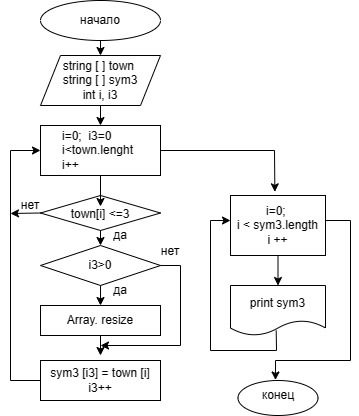

## _*Задача*_:
 Написать программу, которая из имеющегося массива строк формирует новый массив из строк, длина которых меньше, либо равна 3 символам.Первоначальный массив можно ввести с клавиатуры, либо задать на старте выполнения алгоритма. При решении не рекомендуется пользоваться коллекциями, лучше обойтись исключительно массивами.

## _*Примеры*_:
[“Hello”, “2”, “world”, “:-)”] → [“2”, “:-)”]
[“1234”, “1567”, “-2”, “computer science”] → [“-2”]
[“Russia”, “Denmark”, “Kazan”] → []

# Решение:
1. Определяем переменную town как тип **string.** то есть переменная представляет строку.

2.  С помощью типа цикла  **for** перебираем строку, применяя обращение к символам по индексу.

3.  Длина массива указывается свойством **Length**: town.Length.

4. Для изменения размера массива применяем метод **Resize**.

5. блок-схема алгоритма решения

